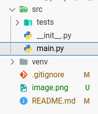
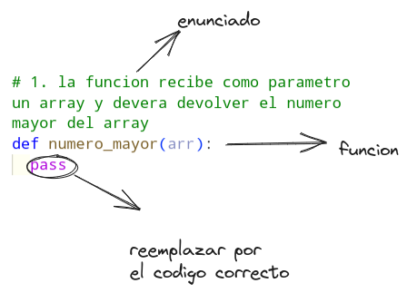

# Examen de recuperacion Python
1. como primer paso deberan forkear el repositorio del examen
   > a traves del navegador de github buscar el ususario `hackanonimous` en repositorios ubicarse en el repo `examen_python_recu` una vez echo esto deberan forkear el proyecto haciendo click en fork

seguir las instruciones y hacer el fork


2. deveran crear un nuevo entorno virtual y activarlo
   ##### Creando el entorno virtual
   ```bash
   python -m venv venv
   ```
   ##### Activando el entorno virtual en `bash`
   ```bash
   source venv/Scripts/activate
   ```
   ##### Activando el entorno virtual en `Power Shell`
   ```bash
   .\venv\Scripts\Activate.ps1
   ```
3. Instalar las dependencias
   ```bash
   pip install pytest
   ```
4. dirigirse al archivo en al ruta `src/main.py`
   
5. en los ejercicio se devera reemplazar la palabra reservada `pass` por el codigo de solucion del ejercicio
   
6. luego se devera comprobar que haya pasado el test ejecutando el siguiente codigo
   ```bash
   pytest -v
   ```
7. una vez solucionado los ejercicios hacer el push a su repositorio.